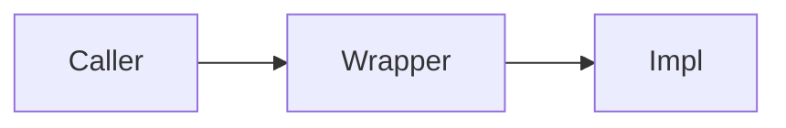

# Codebase Review Report — {SCOPE_NAME}

> **Scope type:** {Codebase | Module | Feature}
> **Reviewed:** {date}  ·  **Reviewer:** Codebase Review skill
> **Target:** {repo / branch / commit if known}

Fill this template from the review. Keep the section order. Delete a section only if it is genuinely empty (and say so — e.g. "No security findings"). Every finding uses the finding block format below.

---

## 1. Executive Summary

Three to six sentences a lead can read in under a minute: what was reviewed, the overall health, and the single most important thing to do next. State the headline counts: `N Critical · N High · N Medium · N Low`, plus how many commendations. If there is one thing that must be fixed before shipping, say it here in one line.

## 2. Scope & Methodology

- **What was reviewed** — the exact files/folders/modules (list them). Note what was explicitly *out* of scope.
- **How** — generic, capability, project-profile, repository, and official-technology lenses applied; name the exact technical foundation version and reference sources used.
- **Tooling signals** — commands discovered from project configuration and actually run, with their results. If tooling could not be run, say so and note which coverage remains static-only.
- **Profile coverage** — selected technologies reviewed, guidance versions used, unselected recommendations skipped, and any generic-only or unverified technology coverage.
- **Limitations** — sampling (for large codebases, including which hot spots the commit history pointed at), anything not verifiable, assumptions made.

## 3. Risk-Ranked Findings (Overview)

The triage table — sorted by **Risk score descending**. This is the "read this first" section. The **⚡** column flags findings whose real-world urgency exceeds their computed risk band (directly exploitable, or a single occurrence that is still a breach / still corrupts money) — see the Urgency note in the finding detail. Keep the Risk cell as the honest computed band; never write hybrid values like `Medium → Critical`.

| # | Finding | Area (ID) | Location | Severity | Freq | Risk | ⚡ | Recommendation |
|---|---------|-----------|----------|----------|------|------|----|----------------|
| 1 | {short title} | {e.g. SEC-2} | `path/to/file:42` | S4 | F4 | 🔴 Critical (16) |  | 🔴 Must-fix |
| 2 | {short title} | {e.g. project guidance ID} | `path/to/file:83` | S4 | F1 | 🟡 Medium (4) | ⚡ | 🔴 Must-fix |
| … | | | | | | | | |

## 4. Findings by Recommendation Category

Group the same findings by their recommendation tag so the reader can scan "what must I fix" vs "what's nice to have". List each finding's number + title under its tag (full detail is in Section 5).

**⛔ Antipatterns** — {#, title} …
**🔴 Critical / Must-fix** — …
**🟠 Strong** — …
**🟡 Preferable** — …
**🔵 Optional / Nit** — …
**🟢 Commendations** — …

## 5. Detailed Findings

Ordered by risk score descending; secondary-grouped by area. Verifiable `ARCH` findings (e.g. an evident pass-through failing the deletion test, tests coupled to internals) use this same block with a normal S×F score — speculative restructures do NOT appear here (they go to §6). One block per finding, using this exact format:

---

### {N}. {Concise finding title}

- **Recommendation:** {⛔ Antipattern | 🔴 Must-fix | 🟠 Strong | 🟡 Preferable | 🔵 Optional | 🟢 Commendation}
- **Risk:** {🔴 Critical | 🟠 High | 🟡 Medium | 🟢 Low} ({score}) — S{n} × F{n}  *(honest computed band — do not inflate)*
- **Urgency:** {⚡ only when needed} one line on why real urgency exceeds the computed band (e.g. "directly exploitable by any untrusted caller; fix before ship despite F1"). Omit this line entirely when the risk band already reflects the urgency.
- **Standard:** `{CATALOG-ID}` {Standard name}
- **Location:** `path/to/file.ext:line` ({function/component name})

**What** — the issue, with the offending snippet quoted if short:

```text
// the actual code
```

**Why it matters** — the concrete failure mode *in this codebase* (what breaks, when, for whom). Not a textbook definition.

**Fix** — a specific change that fits the surrounding patterns; short code sketch if it clarifies. If the fix would contradict a repo ADR, say so explicitly ("contradicts ADR-00XX — worth reopening because …") or propose an ADR-compatible alternative:

```text
// the suggested shape
```

**References** — {repo ADR/doc/CONTEXT.md link} · {external authority — official docs / OWASP / web.dev / MDN, precise page}

---

*(repeat for each finding; commendations use the same block but Why/Fix become "why it's good" / "keep doing this")*

## 6. Themes & Systemic Observations

Patterns that span multiple findings — the root causes worth a broader fix (e.g. "server-side authorization is inconsistent across the OR routers", "no shared error-mapping helper, so each router leaks differently"). This is where you help the team fix classes of problems, not just instances.

### 6.1 Deepening opportunities (architecture)

Optional — include only when the review surfaced real candidates. These are **unscored**: restructures worth exploring, not defects, so they carry a confidence badge instead of an S×F score (see "Route by confidence" in the skill). Use the architecture vocabulary from the `q-code-grill-design` skill's glossary (module, interface, depth, seam, adapter, leverage, locality) together with the domain terms from `CONTEXT.md` — "the Order intake module", not "the FooBarHandler".

One block per candidate:

- **Candidate:** {short name of the deepening, e.g. "Collapse the Order intake pipeline"}
- **Confidence:** {`Strong` | `Worth exploring`} *(purely speculative ideas don't make the report)*
- **Files/modules involved:** `path/…`, `path/…`
- **Friction** — what hurts today, in one or two sentences (shallowness, leakage, lost locality, untestability).
- **Direction** — plain-language description of the deepened shape; name the **dependency category** (in-process / local-substitutable / remote-owned / true-external) so the testing strategy is implied.
- **Expected wins** — in glossary terms: leverage (one interface, N call sites), locality (bugs concentrate in one module), tests that survive refactors.
- **ADR note** (if applicable) — *"contradicts ADR-00XX — worth reopening because …"*. Only list a candidate that contradicts an ADR when the friction genuinely warrants revisiting it.
- **Before / After** (optional, when structure beats prose) — a Mermaid block embedded in the Markdown, or a generated image referenced from it:



Close the subsection with the candidate you'd tackle first and why, and note that exploring a candidate further (interface design, constraints, what sits behind the seam) is a job for the `q-code-grill-design` flow — not for this report.

## 7. Suggested Remediation Order

A short, sequenced action list: what to fix first and why (usually Critical/High risk and quick-win antipatterns first), grouped into sensible batches. Reference finding numbers.
