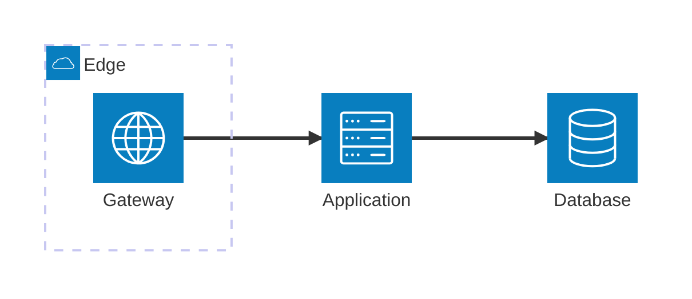

# Architecture

Use `architecture-beta` for supported infrastructure topology or a portable flowchart for maximum compatibility. The architecture owner supplies components, services, trust boundaries, protocols, and deployment relationships.

Treat renderer support as experimental until canonical validation passes. Fall back to a labeled flowchart rather than claiming unsupported coverage.

