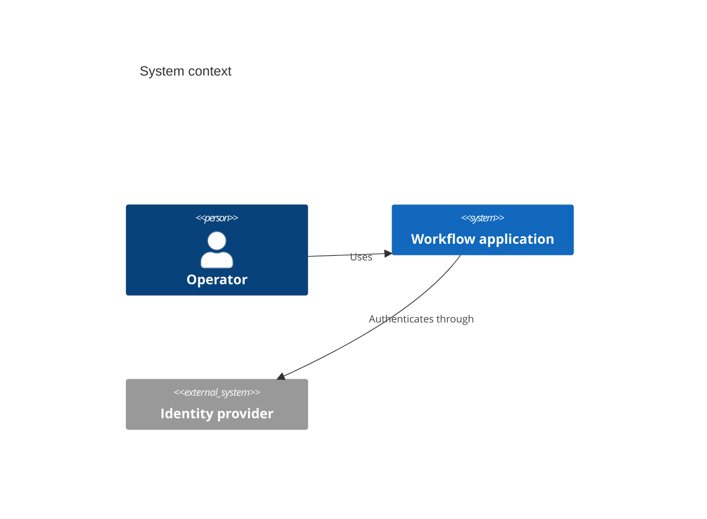

# C4

Use Mermaid C4 syntax to encode an approved system-context or container view whose people, systems, containers, boundaries, and relationships were fixed by the architecture owner or by `q-tool-c4`; route a request to model, choose levels or views, or synchronize several views to `q-tool-c4`. Prefer context and container levels; component and code levels often become too dense.

Preserve people, systems, containers, boundaries, and relationship labels from the architecture owner. If the target renderer lacks C4 support, encode the same approved elements in a portable flowchart and report the compatibility fallback.

