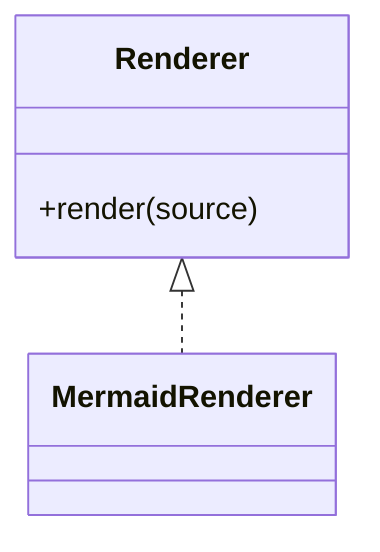

# Class diagram

Use `classDiagram` for static type relationships, interfaces, inheritance, composition, and selected members. Use ER for persistence cardinality and flowcharts or sequence diagrams for runtime behavior.

Do not infer methods, visibility, multiplicity, or inheritance from naming alone.

