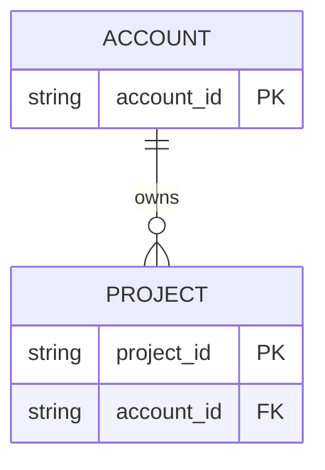

# Entity relationship diagram

Use `erDiagram` only after the domain owner approves entities, keys, and cardinalities. Preserve domain names and express important relationship meaning in canonical text as well as labels.

Mermaid ER cardinality markers are compact and easy to misread. Return uncertainty to `q-plan-domain-model`; never choose one-to-one, optionality, ownership, or deletion behavior here.

