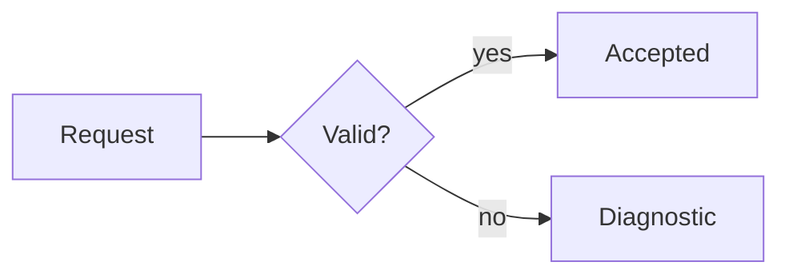

# Flowchart

Use `flowchart LR` or `flowchart TB` for processes, choices, dependencies, and conceptual topology. Use stable node IDs, quote labels with punctuation, label meaningful edges, and close every `subgraph` with `end`.

Keep decisions as questions and make each outgoing condition explicit. Do not use a flowchart to invent temporal order or ownership absent from the sources.

