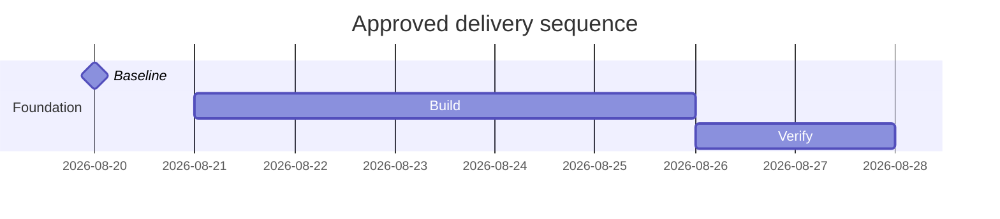

# Gantt

Use `gantt` only for dates, durations, dependencies, and milestones approved by the schedule or backlog owner. A Gantt render is derived presentation and never replaces the canonical backlog or commercial schedule.

If accessibility directives are unsupported by the resolved Mermaid version, add equivalent adjacent alt text in the embedding channel.

