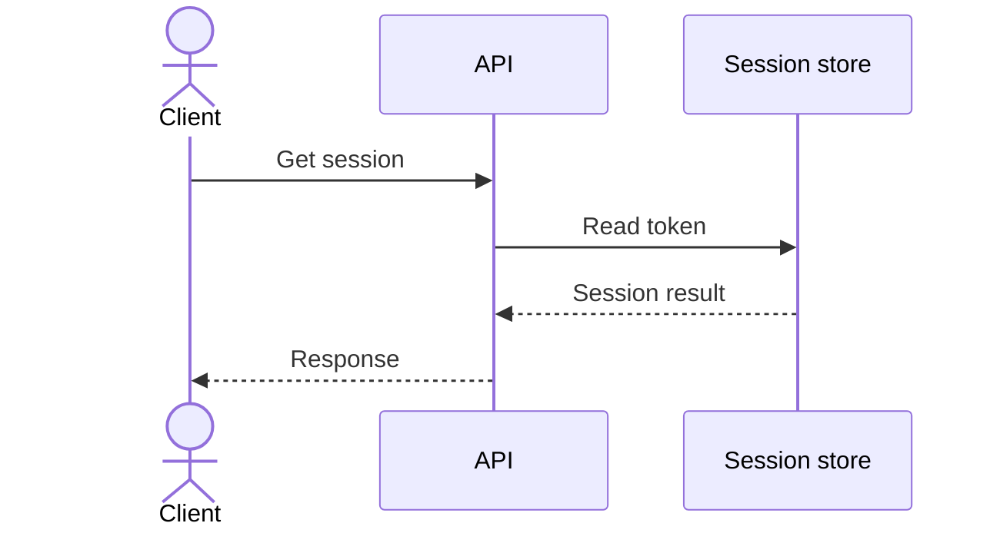

# Sequence diagram

Use `sequenceDiagram` when order, responsibility, request/response, async messages, retries, or alternate outcomes matter. Name participants by role, keep message labels action-oriented, and use `alt`, `opt`, `loop`, or `par` only when the source supports that control structure.

Do not infer calls, protocols, responses, or error behavior.

