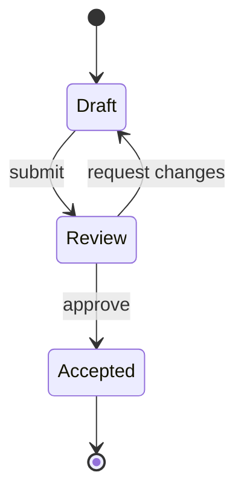

# State diagram

Use `stateDiagram-v2` for approved states, transitions, guards, and terminal conditions. State names are domain semantics: preserve them exactly and do not convert activities into new states without owner approval.

