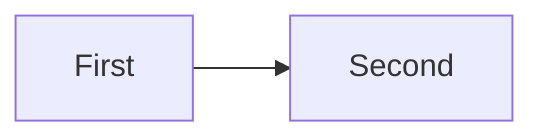
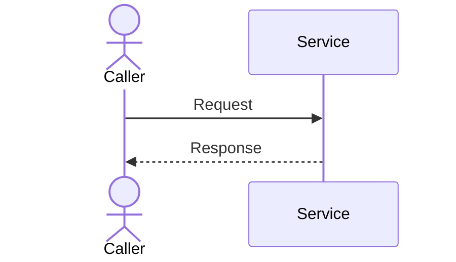

# Fixture

```mermaid
flowchart LR
    accTitle: First diagram
    accDescr: The first node points to the second node.
    first[First] --> second[Second]
```

```mermaid
sequenceDiagram
    accTitle: Second diagram
    accDescr: A caller sends a request and receives a response.
    actor caller as Caller
    participant service as Service
    caller->>service: Request
    service-->>caller: Response
```
