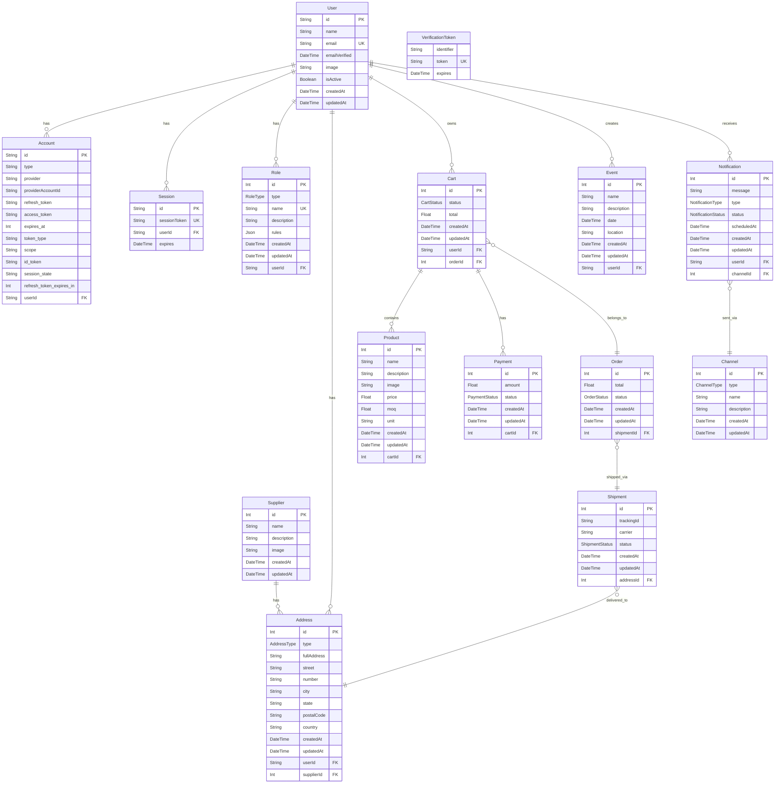

# Database Entity Relationship Diagram

## Enums

### RoleType
- ADMIN
- USER
- ALLY (FRACTIONATOR + PICKER)
- FRACTIONATOR
- PICKER
- SUPPLIER
- CARRIER

### AddressType
- HOME
- WORK
- SHIPPING
- BILLING
- FRACTIONING

### CartStatus
- ACTIVE
- CHECKED_OUT
- ABANDONED

### OrderStatus
- DRAFT
- PAYMENT_PENDING
- COMPLETED
- CANCELLED_BY_USER
- CANCELLED_BY_ADMIN
- CANCELLED_BY_TIMEOUT
- PAYMENT_FAILED
- REFUNDED

### ShipmentStatus
- PENDING
- SHIPPED
- DELIVERED
- RETURNED

### PaymentStatus
- PENDING
- COMPLETED
- FAILED

### NotificationType
- INFO
- WARNING
- ERROR
- SUCCESS

### NotificationStatus
- PENDING
- SENT
- READ
- FAILED
- RETRY

### ChannelType
- EMAIL
- SMS
- PUSH
- IN_APP
- WHATSAPP

## Key Relationships

1. **User Management**: Users have accounts, sessions, roles, and addresses
2. **E-commerce Flow**: Users create carts → carts become orders → orders are shipped
3. **Product Management**: Products belong to carts
4. **Payment Processing**: Carts have associated payments
5. **Shipping**: Orders are shipped via shipments to specific addresses
6. **Notifications**: Users receive notifications through various channels
7. **Events**: Users can create and manage events
8. **Suppliers**: Have addresses and supply products (relationship implied)

## Notes

- The schema includes authentication models (Account, Session, VerificationToken) likely for NextAuth.js
- Cart and Order have a one-to-many relationship (one order can contain multiple carts)
- Address entities can belong to either users or suppliers
- The notification system supports multiple delivery channels
